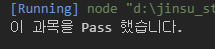
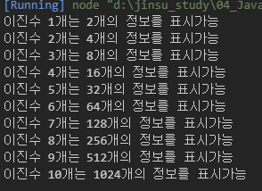

## 박진수 for문 연습문제 과제
<hr />

### 2021-08-19

### 문제1

```javascript
const 수학 = "B";

if(수학 == "A" || 수학 == "B" || 수학 == "C") {
    console.log("이 과목을 Pass 했습니다.");
} else {
    console.log("이 과목을 Pass하지 못했습니다.");
}
```



### 문제2
```javascript
let num = 1;
while(num < 11) {
    let answer = 2**num;
    console.log(`이진수 ${num}개는 ${answer}개의 정보를 표시가능`);
    num++;
}
```


### 문제3
```javascript
for(let i=1; i < 11; i++) {
    let answer = 2**i;
    console.log(`이진수 ${i}개는 ${answer}개의 정보를 표시가능`);
}
```
