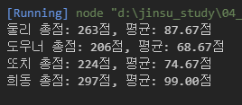
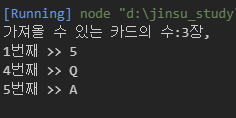

## 박진수 Array 과제
<hr />

>2021-08-21

### 문제1

```javascript
const check_list = [true, false, false, true, false];
console.log("before -> " + check_list);

for(let i=0; i < check_list.length; i++) {
    check_list[i] = check_list[i] == true ? false : true;
}

console.log("after -> " + check_list);
```


### 문제2
-이 점수표를 grade라는 이름의 1차원 배열로 구성하고 이 배열을 활용하여 총점을 의미하는 변수 sum과 평균을 의미하는 변
수 avg를 구하시오. -> 점수표의 점수를 1차원 배열로 설정이아니라 점수표 자체를 1차원 배열로 설정
```javascript
let sum = 0;
let gradeTitle = 0;
let grade = ["HTML", 75,"CSS", 82,"Javascript", 91];
for(i=0; i < grade.length; i++) {
    if(typeof grade[i] == "number" ){
        sum += grade[i];
    } else {
        gradeTitle++
    }
}
let avg = sum / (grade.length - gradeTitle);
console.log(`총점은 ${sum}이고, 평균은 ${avg} 입니다.`);
```


### 문제3
```javascript
let beforeRate = 0;
let afterRate = 0;
let transRateDate = 0;
let timeTable = [["일", 7], ["월", 5], ["화", 5], ["수", 5], ["목", 5], ["금", 10], ["토", 7]];
for(i=0; i < timeTable.length; i++) {
    if(!(timeTable[i][0] == "목")) {
        beforeRate += timeTable[i][1];
        transRateDate++;
    } else {
        break;
    }
}
for(i=transRateDate; i < timeTable.length; i++) {
    afterRate += timeTable[i][1];
} 

let weekSalay = (beforeRate*4500) + (afterRate*5200);
console.log(weekSalay);
```


### 문제4
```javascript
let price = [38000, 20000, 17900, 17900];
let qty = [6, 4, 3, 5];
let money = 0;

for(i=0; i < 4; i++) {
    let temp = price[i] * qty[i];
    money += temp
}
console.log(money);
```


### 문제5
```javascript
let price = [38000, 20000, 17900, 17900];
let qty = [6, 4, 3, 5];
let max = 0;

for(i=0; i < 4; i++) {
    let temp = price[i] * qty[i];
    if( temp > max ) {
        max = temp;
    }
}
console.log(max);
```


### 문제6
```javascript
let price = [38000, 20000, 17900, 17900];
let qty = [6, 4, 3, 5];
let count = 0;

for(i=0; i < 4; i++) {
    let temp = price[i] * qty[i];
    if( temp > 79999) {
        count++;
    }
}
console.log(count);
```


### 문제7
```javascript
let money = [209000, 109000, 119000, 109000, 94000];
for(i=0; i < money.length-1; i++) {
    for(j=i+1; j < money.length; j++) {
        if(money[i] > money[j]) {
            let temp = money[i];
            money[i] = money[j];
            money[j] = temp;
        }
    }
}
console.log(money);
```


### 문제8
```javascript
const arr = [5, 3, 2, 8, 9];
let official = arr.length % 2 == 0 ? 1 : 2;
for(let i=0; i < official; i++) {
    let target = arr.length -1 -i;

    let temp = arr[i];
    arr[i] = arr[target];
    arr[target] = temp;
}

console.log(arr);
```


### 문제9
```javascript
let student = ["둘리", "도우너", "또치", "희동"];
let grade = [ [78, 89, 96], [62, 77, 67], [54, 90, 80], [100, 99, 98] ];
let sumArr = new Array(4);
for(let i=0; i < grade.length; i++) {
    let sum = 0;
    for(let j=0; j < grade[i].length; j++) {
        sum += grade[i][j];
    }            
    sumArr[i] = sum;
}
for(let j=0; j < student.length; j++) {
    console.log(`${student[j]} 총점: ${sumArr[j]}점, 평균: ${(sumArr[j]/3).toFixed(2)}점`);
}
```



### 문제10
```javascript
let student = ["둘리", "도우너", "또치", "희동"];
let grade = [ [78, 89, 96], [62, 77, 67], [54, 90, 80], [100, 99, 98] ];
let sumArr = new Array(4);
let avg = 0;
let allAvg = 0;
for(let i=0; i < grade.length; i++) {
    let sum = 0;
    for(let j=0; j < grade[i].length; j++) {
        sum += grade[i][j];
    }            
    sumArr[i] = sum;
}
for(let i=0; i < sumArr.length; i++) {
    avg = sumArr[i]/3;
    allAvg += avg
}
console.log(allAvg/student.length);
```


### 문제11
```javascript
let itemArr = [ [500, 291], [320, 586], [100, 460], [120, 558], [92, 18], [30, 72]];
let sell = 0;
for(let i=0; i < itemArr.length; i++) {
        sell += itemArr[i][0] * (itemArr[i][1]*0.9);
    }
console.log(sell);
```


### 문제12
```javascript
let names = ["재석", "민영", "종민", "광수", "승기", "새정"];
let points = [82, 91, 54, 62, 88, 90];

for(i=0; i < points.length-1; i++) {
    for(j=i+1; j < points.length; j++) {
        if(points[i] < points[j]) {
            let temp = points[i];
            points[i] = points[j];
            points[j] = temp;
            
            temp = names[i];
            names[i] = names[j];
            names[j] = temp;
        }
    }
}

console.log(names);

```


### 문제13
```javascript
let mathArr = new Array(5);
for (let i=0; i < 5; i++) {
    mathArr[i] = new Array(5);
}

for (let i=0; i < mathArr.length; i++) {
    for (let j=0; j < mathArr[i].length; j++) {
        if(i == j) {
            mathArr[i][j] = 1;
        } else {
            mathArr[i][j] = 0;
        }
    }
}

console.log(mathArr);
```


### 문제14
```javascript
let cardArr1 = [1, 5, 7, "J", "Q", "A"];
let cardArr2 = [2, 3, 4, 5, "Q", "K", "A"];
let count = 0;
let result = new Array();
for(let i=0; i < cardArr1.length; i++) {
    for(let j=0; j < cardArr2.length; j++) {
        if( cardArr1[i] == cardArr2[j]) {
            result[count]= i + "번째 >> " + cardArr1[i];
            count++;
        }
    }
}
console.log(`가져올 수 있는 카드의 수:${count}장, `)
for(let i=0; i < result.length; i++) {
    console.log(`${result[i]}`);
}
```


